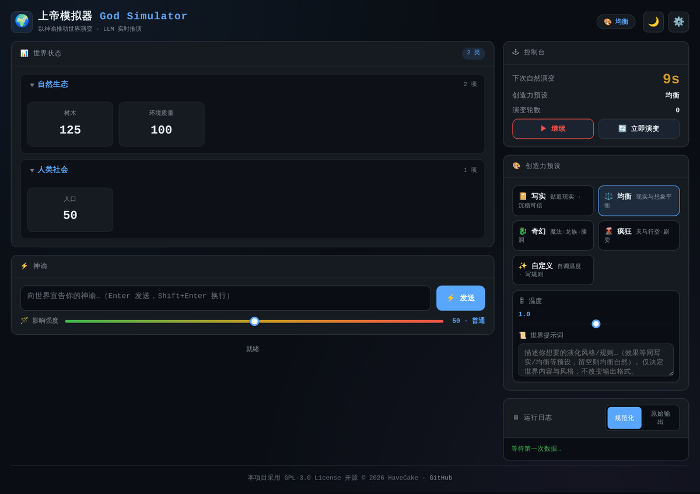
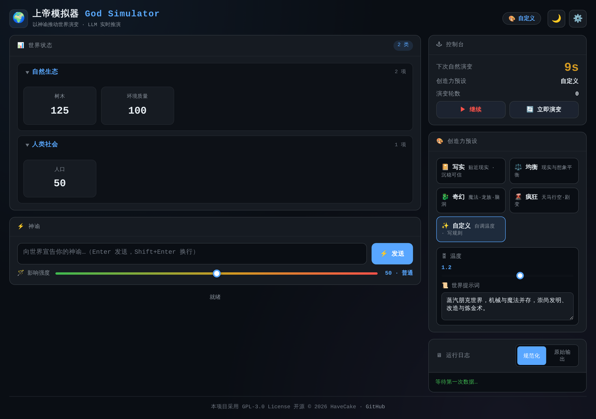
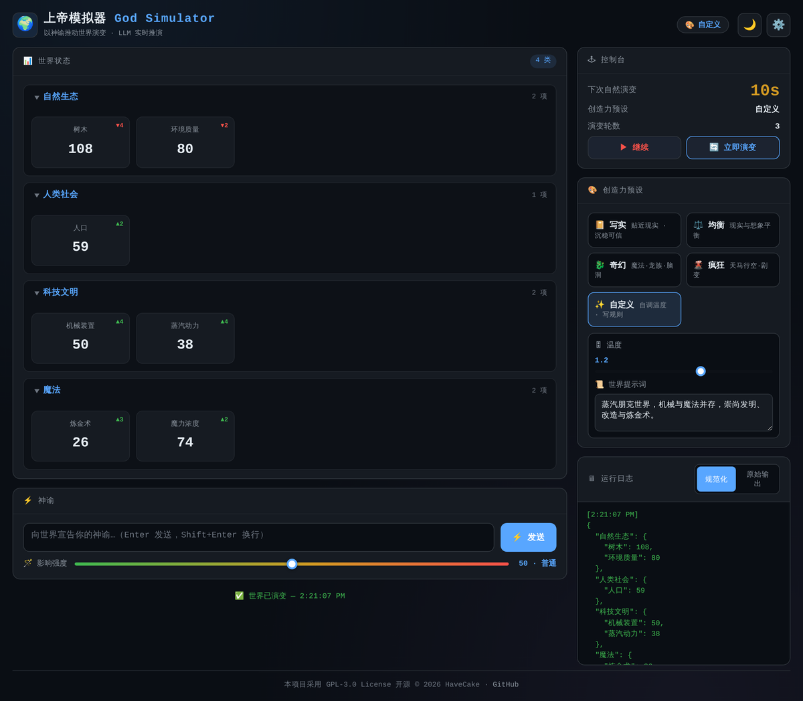
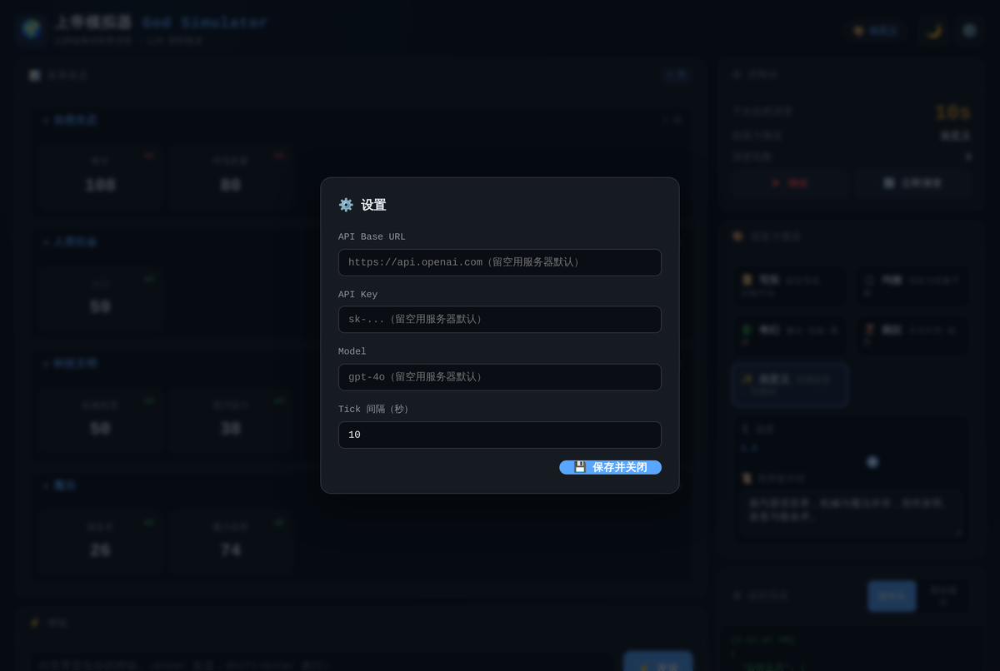

# 🌍 WorldBox — 上帝模拟器

一款基于大语言模型（LLM）驱动的极简文字"上帝模拟器"。玩家扮演造物主，向世界发出**神谕**，LLM 负责推演世界的演变结果，并将新的世界状态实时展示在浏览器中。


[](https://worldbox.20110228.xyz)

> **🌐 在线体验**：[https://worldbox.20110228.xyz](https://worldbox.20110228.xyz) 是一个**在线测试站点**，无需部署、打开即用；前端亦提供了自托管部署方式（见下文）。

---

## 📸 截图预览

<div align="center">

**主页 · 世界状态与创造力预设**



**自定义创造力**（可调温度 + 编写世界提示词，效果等同预设）



**自定义世界推演**（"蒸汽朋克"世界提示词生成的独特世界：科技文明、魔法）



**设置面板**（API 配置，创造力设置已集中在主页、不再在设置内重复）



</div>

---

## ✨ 功能特性

- **自动演变**：世界按设定的时间间隔（Tick）自动推演，呈现自然生态、人口、科技等属性的变化。
- **神谕输入**：玩家可随时输入自然语言指令（神谕），LLM 会优先结算神谕影响后再叠加自然演变。
- **动态状态面板**：世界状态以嵌套分类卡片展示，数值上升/下降/新增时有高亮动画提示，并显示变化趋势箭头。
- **规范化安全层**：服务端与前端均内置**双重防御性校验**——无论 LLM 输出何种不规范内容（多余文字、单引号/尾逗号、结构漂移、数组/布尔/字符串当数值、NaN/Infinity 等），都会被自动规范化成合法状态，**绝不中断推演**。
- **LLM 提示词规范**：系统提示词采用严格 JSON Schema 约束 + Few-shot 示例 + 数值范围规范，从源头降低 LLM 输出不规范的几率。
- **错误分类与日志标签页**：运行日志区分「规范化状态」与「LLM 原始输出」两个标签页，便于对照调试；出现规范化时顶部会展示黄色警告条说明具体修复项。
- **Raw JSON 日志**：实时展示每一轮 LLM 返回的原始 JSON，方便调试。
- **明/暗主题切换**：支持深色与浅色主题，偏好保存于本地存储。
- **可配置参数**：API 地址、Key、模型、AI 创造力（Temperature）、Tick 间隔均可在设置面板中修改并持久化。
- **自定义创造力**：除「写实 / 均衡 / 奇幻 / 疯狂」四大预设外，新增「自定义」模式，可自由调节温度（0–2）并编写专属**世界提示词**，让 LLM 按你设定的风格推演（如蒸汽朋克、赛博朋克、末日废土等）。
- **提示词与格式严格隔离**：用户编写的「世界提示词」与「输出格式约束」始终分属**两条独立的 System 消息**——自定义内容只决定世界的内容与风格，永远无法破坏 LLM 输出的 JSON 规范，确保推演绝不中断。
- **主页统一管理创造力**：创造力预设精简为**仅放置在主页**（顶部胶囊 + 侧栏快捷预设），设置弹窗不再重复，避免两处配置互相冲突。
- **服务端默认配置**：管理员可在服务器的 `.env` 文件中预设 API 地址、Key 和模型，用户无需填写即可直接使用；未配置时行为与之前完全一致，仍需用户自行填写。
- **URL 自动规范化**：无论用户填写的是 `https://api.openai.com`、`https://api.openai.com/v1` 还是完整路径，服务端均能自动修正为正确的 Chat Completions 端点；格式错误时会明确提示。
- **兼容任意 OpenAI 兼容接口**：只要提供符合 OpenAI Chat Completions 规范的 API 即可，支持 OpenAI、Azure、本地部署模型等。

---

## 🛠 技术栈

| 层次 | 技术 |
|------|------|
| 后端 | Node.js (≥18) + Express + dotenv |
| 前端 | 纯 HTML/CSS/JavaScript（无框架） |
| AI   | 任意 OpenAI 兼容 Chat Completions API |
| 测试 | Node.js 内置 `node:test` |

---

## 📋 前置条件

- **Node.js** `>= 18.0.0`
- 可用的 **OpenAI 兼容 API**（如 OpenAI、Azure OpenAI、本地 Ollama 等）及对应 API Key

---

## 🚀 安装与启动

```bash
# 克隆仓库
git clone https://github.com/HaveCake/worldbox.git
cd worldbox

# 安装依赖
npm install

# （可选）配置服务端默认 API 凭据，详见下方"服务端默认配置"一节
cp .env.example .env
# 然后编辑 .env，填入你的 DEFAULT_API_URL / DEFAULT_API_KEY / DEFAULT_MODEL

# 启动服务器（默认端口 3000）
npm start
```

启动后在浏览器中访问：

```
http://localhost:3000
```

如需自定义端口，可设置环境变量：

```bash
PORT=8080 npm start
```

---

## ⚙️ 配置

### 前端用户配置

首次打开页面后，点击右上角的 **⚙️ 设置** 按钮，填写以下参数：

| 参数 | 说明 | 示例 |
|------|------|------|
| **API Base URL** | LLM 接口地址，支持多种格式（见下方说明） | `https://api.openai.com` |
| **API Key** | 对应 API 的鉴权 Key | `sk-...` |
| **Model** | 使用的模型名称 | `gpt-4o` |
| **AI 创造力 (Temperature)** | 控制 LLM 输出随机性，范围 0–2 | `1.2` |
| **Tick 间隔（秒）** | 世界自动演变的时间间隔 | `10` |

> **API Base URL 格式**：以下写法均被自动识别并修正，无需手动补全路径：
> - `https://api.openai.com`
> - `https://api.openai.com/v1`
> - `https://api.openai.com/v1/chat/completions`
>
> 若服务端已配置默认值，三个字段均可留空，留空时将使用服务器默认配置。

配置保存于浏览器的 `localStorage`，刷新页面后自动恢复。

### 服务端默认配置（可选）

适用于**自用**或**给受信任用户使用**的场景：在服务器上预设 API 凭据，用户无需在前端填写任何 API 信息即可直接使用。

1. 复制模板文件：

   ```bash
   cp .env.example .env
   ```

2. 编辑 `.env`，填入你的默认值：

   ```dotenv
   DEFAULT_API_URL=https://api.openai.com
   DEFAULT_API_KEY=sk-your-key-here
   DEFAULT_MODEL=gpt-4o
   ```

3. 重启服务器，配置即生效。

> **说明**：
> - 三个环境变量均为可选，可只设置部分。
> - 用户在前端填写的值**优先级更高**，会覆盖服务端默认值。
> - 未配置且用户也未填写时，`/evolve` 接口仍会返回 400 错误，提示用户填写。
> - `.env` 文件已加入 `.gitignore`，不会被提交到版本库。

---

## 🎮 使用说明

1. 完成配置后，世界将按 Tick 间隔**自动演变**，倒计时显示在控制栏左侧。
2. 在底部输入框键入**神谕**（自然语言指令），点击 **⚡ 发送神谕** 或按 `Enter`，可立即触发一次带指令的演变。
3. 点击 **⏸ 暂停** 可暂停自动演变，再次点击恢复。
4. 世界状态面板中，各属性卡片会以颜色动画区分**上升**（绿色）、**下降**（红色）、**新增**（黄色）。
5. 展开/收起各大类分类，可聚焦关注特定领域的状态。

---

## 🔌 API 参考

### `POST /evolve`

触发一次世界演变推演。

**请求体（JSON）：**

| 字段 | 类型 | 必填 | 说明 |
|------|------|------|------|
| `apiUrl` | string | ⚠️ 条件必填 | LLM API 地址（多种格式均支持）；若服务端已设置 `DEFAULT_API_URL` 则可省略 |
| `apiKey` | string | ⚠️ 条件必填 | API 鉴权 Key；若服务端已设置 `DEFAULT_API_KEY` 则可省略 |
| `model` | string | ⚠️ 条件必填 | 模型名称；若服务端已设置 `DEFAULT_MODEL` 则可省略 |
| `current_state` | object | ✅ | 当前世界状态 JSON 对象 |
| `user_prompt` | string | ❌ | 玩家神谕（为空时进行自然演变） |
| `temperature` | number | ❌ | LLM 温度参数（0–2） |

**成功响应（200）：**

返回推演后的结果，结构为：

```json
{
  "state": {
    "自然生态": { "树木": 120, "环境质量": 98 },
    "人类社会": { "人口": 52, "食物": 85 }
  },
  "raw": "{\"自然生态\":{\"树木\":120,...}}",
  "warnings": []
}
```

| 字段 | 说明 |
|------|------|
| `state` | **规范化后**的世界状态。已保证为合法的嵌套对象，所有值为 0–1,000,000 之间的有限整数，不含数组/null/布尔/字符串/NaN/Infinity |
| `raw` | LLM 返回的**原始内容**（未做任何处理），用于调试对照 |
| `warnings` | 规范化过程中产生的警告列表（如"属性 X 收到非数值内容，已重置为 0"），无问题时为空数组 |

> 即使 LLM 输出严重偏离规范，`state` 也永远是合法可渲染的状态，`/evolve` 不会因数据问题而抛错。

**错误响应：**

| 状态码 | 说明 |
|--------|------|
| `400`  | 缺少必填字段，或 `apiUrl` 格式无效 |
| `500`  | 服务器内部错误（网络请求失败等） |
| `502`  | LLM 返回无法解析为 JSON 的内容（原始内容会放在 `raw` 字段返回） |

> **版本兼容**：若你使用旧版本后端（直接返回世界状态对象而非 `{state, raw, warnings}`），新前端会自动识别并兼容，无需修改。

---

## 📁 项目结构

```
worldbox/
├── public/
│   └── index.html      # 单页前端应用（含双重防御性校验 + 日志标签页 + 自定义创造力）
├── test/
│   └── server.test.js  # 后端单元测试（含规范化的边界用例 + 自定义提示词）
├── server.js           # Express 后端入口（含严格 Prompt 规范 + sanitizeState 规范化 + buildCustomPrompt）
├── docs/
│   └── screenshots/    # README 使用的界面截图
├── .env.example        # 服务端默认配置模板（复制为 .env 后填入真实值）
├── package.json
└── README.md
```

> `.env` 文件（真实密钥）已加入 `.gitignore`，不会被提交到版本库。

---

## 🧪 运行测试

```bash
npm test
```

测试使用 Node.js 内置 `node:test` 模块，无需额外安装依赖。

---

## 📄 许可证

本项目基于 [GPL-3.0 License](./LICENSE) 开源。